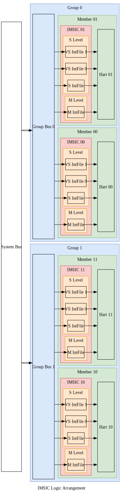

# 📩IMSIC

<!-- vim-markdown-toc GFM -->

* [单个IMSIC的功能（Individual IMSIC Functionality）](#单个imsic的功能individual-imsic-functionality)
  * [IMSIC的输入与输出（IMSIC IO）](#imsic的输入与输出imsic-io)
  * [中断文件的输入与输出（Interrupt File IO）](#中断文件的输入与输出interrupt-file-io)
  * [中断文件的内存映射寄存器（Interrupt File Memory-mapped Registers）](#中断文件的内存映射寄存器interrupt-file-memory-mapped-registers)
  * [中断文件内部的寄存器（Interrupt File Internal Registers）](#中断文件内部的寄存器interrupt-file-internal-registers)
* [多个IMSIC的组织形式（Multiple IMSICs Arrangement）](#多个imsic的组织形式multiple-imsics-arrangement)
  * [IMSIC地址字段（IMSIC Address Fields）](#imsic地址字段imsic-address-fields)
  * [IMSIC内存区域（IMSIC Memory Regions）](#imsic内存区域imsic-memory-regions)

<!-- vim-markdown-toc -->

在典型的RISC-V系统中，每个处理器核心都配有专用的IMSIC。
IMSIC执行三个主要功能:

* 通过内存映射寄存器接收MSI，
* 为其关联的处理器核心生成中断，
* 管理处理器核心所需的AIA控制寄存器。

In a typical RISC-V system, each hart is paired with its dedicated IMSIC.
The IMSIC performs three main functions:

* Receives MSIs through memory-mapped registers,
* Generates interrupts for its associated hart,
* Manages AIA CSRs under hart control.

在对称多处理系统中，多个“核-IMSIC”对可以划分成组，
每组包含相同数量的核-IMSIC对。

In symmetric multiprocessing systems, multiple harts-IMSIC pairs can be organized into groups,
with each group containing an equal number of pairs.

## 单个IMSIC的功能（Individual IMSIC Functionality）

### IMSIC的输入与输出（IMSIC IO）

IMSIC与其处理器核心紧密耦合，
直接使用线路连接而不是总线/网络进行信息传输。
其关键信号包括:

* `pendings`: 每个中断文件的待处理中断状态。
* `{m,s,vs}topei`: 每个特权态中，优先级最高的外部中断号。
* `{m.s,vs}iselect`: 每个特权态中，间接访问控制寄存器的地址。
* `{m,s,vs}ireg`: 每个特权态中，间接访问控制寄存器所读写的数据。
* `vgein`: 虚拟化监管态的选择信号。

The IMSIC is tightly coupled with its hart,
directly using wire connection rather than bus/network for information transfer.
Key signals include:

* `pendings`: Pending interrupt status for each interrupt file.
* `{m,s,vs}topei`: Top external interrupt ID for each privilege level.
* `{m.s,vs}iselect`: CSR indirect access address for each privilege level.
* `{m,s,vs}ireg`: Read and write data for indirect CSR access for each privilege level.
* `vgein`: Virtualized supervisor level selector.

### 中断文件的输入与输出（Interrupt File IO）

一个IMSIC负责管理其处理器核心中的所有特权态，
包括：一个机器态、一个监管态和多个虚拟化监管态。
由于每个态的行为在一般情况下是相同的，AIA规范将这些功能模块化成独立且可重用的组件，称为中断文件。
每个中断文件与IMSIC交换与特权态无关的信息:

* `pending`: 该中断文件的中断状态。
* `topei`: 该中断文件中，优先级最高的外部中断号。
* `iselect`: 该中断文件中，间接访问控制寄存器的地址。
* `ireg`: 该中断文件中，间接访问控制寄存器所读写的数据。

One IMSIC manages all privilege levels in its hart,
including: one machine level, one supervisor level, and multiple virtualized supervisor levels.
As the behaviors of each level are identical in general, the AIA specification modularizes these functionalities of each level into independent and reusable components, called interrupt files.
Each interrupt file exchanges privilege-agnostic information with IMSIC:

* `pending`: Interrupt pending status for this interrupt file.
* `topei`: Top external interrupt ID for this interrupt file.
* `iselect`: CSR indirect access address for this interrupt file.
* `ireg`: Read and write data for indirect CSR access for this interrupt file.

### 中断文件的内存映射寄存器（Interrupt File Memory-mapped Registers）

每个中断文件包含一个4KB内存页，用于接收来自总线/网络的消息。
内存页内仅包含一个4B内存映射寄存器:

* `seteipnum`: 位于偏移量0x0处，接收传入的中断号。

Each interrupt file includes a 4KB memory page for receiving messages from bus/network.
The memory page including only one 4B memory-mapped register:

* `seteipnum`: Located at offset of 0x0, receiving incoming interrupt IDs.

### 中断文件内部的寄存器（Interrupt File Internal Registers）

所有上述接口都与中断文件的内部寄存器交互。
关键的内部寄存器包括:

* `eip[intSrcNum位]`: 表示该中断是否待处理。
* `eie[intSrcNum位]`: 表示该中断是否使能。

Each interrupt file maintains internal registers that interact with the interfaces above.
The key internal registers consist of:

* `eip[intSrcNum bits]`: Whether this interrupt is pending.
* `eie[intSrcNum bits]`: Whether this interrupt is enabled.

## 多个IMSIC的组织形式（Multiple IMSICs Arrangement）

在大型系统中，核-IMSIC对可以分成多组。
下图显示了一个对称的4核-IMSIC系统。
这4对被分为2**组**，每组包含2个**成员**(hart-IMSIC对)。

In a large system, hart-IMSIC pairs can be divided into groups.
The below figure shows a symmetric 4-hart-IMSIC system.
These 4 pairs are divided into 2 **groups**, and each group contains 2 **members** (hart-IMSIC pairs).

### IMSIC地址字段（IMSIC Address Fields）

为了支持物理内存保护(physical memory protection, PMP)，相同特权态的中断文件位于同一内存区域:

* 机器态内存区域:
  * 每个处理器核心对应一个机器态中断文件
* 监管态内存区域:
  * 每个处理器核心对应一个监管态中断文件,
  * 每个处理器核心对应多个虚拟化监管态中断文件。

To support physical memory protection (PMP), interrupt files of the same privilege level are located in a same memory region:

* Machine-level memory region:
  * One machine-level interrupt file per hart
* Supervisor-level memory region:
  * One supervisor-level interrupt file per hart,
  * Multiple virtualized supervisor-level interrupt files per hart.

因此，每个处理器核心在机器态内存区域只占一页，但在监管态内存区域占多页，
由**客户号**（监管态为0，虚拟化监管态为1、2、3、...)索引。
需要四个字段来确定一个IMSIC的内存页的地址：

* 特权态：机器态或监管态。
* 组号：该IMSIC所属的组。
* 成员号：该IMSIC所属的成员。
* 客户号：监管态或虚拟化监管态之一。

Thus, each hart has only one page in machine-level memory region and multiple pages in supervisor-level memory region,
indexed by a **guest ID** (0 for supervisor-level, 1,2,3,... for virtualized supervisor level).
When determining the memory page address for a given IMSIC, four fields are needed:

* Privilege Level: Machine level or supervisor level.
* Group ID: The group to which this IMSIC belongs.
* Member ID: The member to which this IMSIC belongs.
* Guest ID: Supervisor level or one of the virtualized supervisor levels.

机器态中断文件的地址表达式为：

The formal expression for a machine-level interrupt file address:

$$
\begin{align}
mIntFileAddr =
& mBaseAddr \\\\
& + groupID \times 2^{mGroupStrideWidth} \\\\
& + memberID \times 2^{mMemberStrideWidth} \\\\
& + guestID \times 4K
\end{align}
$$

虚拟化监管态中断文件的地址表达式为：

The formal expression for a virtualized supervisor-level interrupt file address:

$$
\begin{align}
vsIntFileAddr =
& vsBaseAddr \\\\
& + groupID \times 2^{vsGroupStrideWidth} \\\\
& + memberID \times 2^{vsMemberStrideWidth} \\\\
& + guestID \times 4K
\end{align}
$$

按照AIA规范的要求，`vsGroupStrideWidth`与`mGroupStrideWidth`相同。
更多详细信息，请参阅AIA规范[^imsic_memory_region]。

As required by the AIA specification, the `vsGroupStrideWidth` is the same as the `mGroupStrideWidth`.
For more details, please refer to the AIA specification[^imsic_memory_region].

### IMSIC内存区域（IMSIC Memory Regions）

机器和监管态的内存区域如下所示。

The memory regions for machine and supervisor levels are shown as below.

这里展示一个具体的例子。
假设机器态和监管态的内存区域基地址分别为`0x6100_0000`和`0x8290_0000`，那么每个中断文件的地址为：

Here is a concrete example.
Assuming the base addresses for machine-level and supervisor-level memory regions are `0x6100_0000` and `0x8290_0000`, respectively,
the addresses for each interrupt file are:

* Machine-level interrupt files:
  * IMSIC00: `[0x61000000, 0x61000fff]`
  * IMSIC01: `[0x61001000, 0x61001fff]`
  * IMSIC10: `[0x61008000, 0x61008fff]`
  * IMSIC11: `[0x61009000, 0x61009fff]`
* Supervisor-level interrupt files:
  * IMSIC00: `[0x82900000, 0x82903fff]`
  * IMSIC01: `[0x82904000, 0x82907fff]`
  * IMSIC10: `[0x82908000, 0x8290bfff]`
  * IMSIC11: `[0x8290c000, 0x8290ffff]`

[^imsic_memory_region]: The RISC-V Advanced Interrupt Architecture: 3.6. Arrangement of the memory regions of multiple interrupt files
