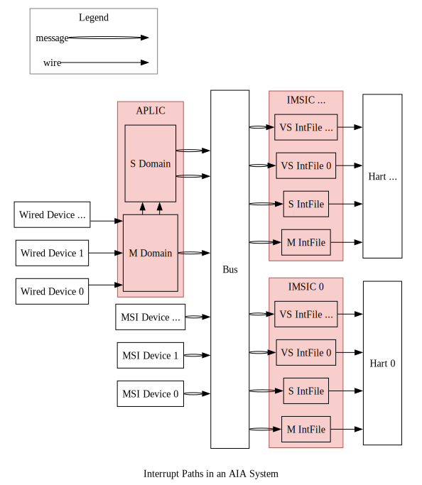
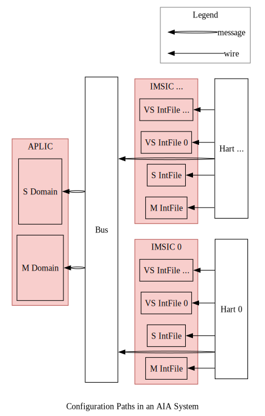

# 😺ChiselAIA

<!-- vim-markdown-toc GFM -->

* [简介（Introduction）](#简介introduction)
* [中断通路（Interrupt Paths）](#中断通路interrupt-paths)
* [配置通路（Configuration Paths）](#配置通路configuration-paths)
* [引用（References）](#引用references)

<!-- vim-markdown-toc -->

ChiselAIA的实现遵循[RISC-V高级中断架构（Advanced Interrupt Architecture, AIA）规范](https://github.com/riscv/riscv-aia)。
实现与规范之间的任何差异都应视为实现bug。

The implementation of ChiselAIA adheres to the [RISC-V Advanced Interrupt Architecture (AIA) Specification](https://github.com/riscv/riscv-aia).
Any discrepancies between the implementation and specification should be treated as implementation bugs.

## 简介（Introduction）

AIA旨在高效地将外部中断路由到对应的处理器核心（hart）和特权态。
这种路由通过两个中断控制器来完成：

AIA is designed to efficiently route external interrupts to the appropriate harts and privilege levels.
This routing is accomplished by two interrupt controllers:

* Incoming Message-Signaled Interrupt Controller (**IMSIC**)
* Advanced Platform-Level Interrupt Controller (**APLIC**)

为什么需要两种控制器？
因为存在两类外部设备：

1. **线设备**：
  通过专用的电信号（边沿或电平）传输中断。
  它的特点是实现简单，可扩展性差。
  因为每个中断都意味着一根连接到处理器核心的物理线。
2. **消息信号中断(Message-signaled-interrupt, MSI)设备**：
    中断被编码为消息，并通过总线/网络传输。
    因为每个中断不需要专用的物理连线，因此MSI与线中断相比，有更好的可扩展性。

Why two types of controllers?
There are two types of external devices:

1. **Wired devices**:
  Interrupts are transmitted via dedicated electronic signals (edge or level),
  which is simple to implement but faces scalability challenges,
  as each interrupt requires an physical wire connected to the hart.
2. **Message-signaled-interrupt (MSI) devices**:
  Interrupts are encoded as messages and transmitted over bus/network,
  which offers better scalability compared to wired interrupts,
  as no dedicated physical wires needed for each interrupt.

在 RISC-V AIA 中：

* **APLIC**负责处理线外部中断。
  **注意**：APLIC可以在两种模式下运行(domaincfg.DM)：
  * **直接递送模式**：APLIC直接将线中断路由到处理器核心，无需IMSIC参与。
  * MSI递送模式：APLIC将线中断转换为MSI并转发给IMSIC。
  * 由于MSI更具扩展性，后续讨论默认APLIC采用MSI递送模式。
* **IMSIC**负责处理MSI。

In RISC-V AIA:

* **APLIC** handles wired external interrupts.
  **Note**: APLIC can operate in two modes (`domaincfg.DM`):
  * **Direct delivery mode**: APLIC directly routes wired interrupts to harts without IMSIC involvement.
  * **MSI delivery mode**: APLIC converts wired interrupts into MSIs and forwards them to IMSIC.
  * Since MSIs represent the more scalable approach, our subsequent discussion assumes the APLIC working in MSI delivery mode.
* **IMSIC** handles MSIs.

设备、中断控制器和处理器核心之间的交互主要涉及两种数据通路：
**中断通路**和**配置通路**，如下面两张图所示。

The interaction between devices, interrupt controllers, and harts involves two main types of data paths:
**interrupt paths** and **configuration paths**, shown as the following two figures.

## 中断通路（Interrupt Paths）

外部中断主要源自外部设备，
尽管在高级使用场景中，内部设备和处理器核心也可以生成“外部”中断
（例如当监管态向虚拟化监管态注入外部中断时）。
接下来的讨论重点关注外部设备生成中断并通过控制器路由到处理器核心的典型情况。

External interrupts primarily originate from external devices,
though in advanced scenarios, internal devices and harts can also generate "external" interrupts
(e.g. when supervisor level injects external interrupts into virtualized supervisor level).
The following discussion focuses on the typical case where external devices generate interrupts that are routed through controllers to harts.

详细的中断通路如下（注：在语言清晰前提下，我们将省略“外部”）：

* 中断来源于线设备或MSI设备：
  * 线设备通路：
      * 中断被转发到APLIC的**中断域**。
      * 每个域负责管理某一特权态的一组处理器核心的中断。
      * 对于大型对称多处理系统，通常两个域就足够了[^two_interrupt_domains]：
        * 一个**机器态域**，
        * 一个**监管态域**。
      * 域遵循层级结构：
        * 所线中断首先到达机器态域。
        * 根据APLIC的配置，每个中断可以：
          * 转换为MSI并通过总线/网络转发给IMSIC，
          * 委托给子域，然后遵循类似的处理流程。
  * MSI设备通路：
    * MSI通过总线/网络直接路由到IMSIC。
* IMSIC处理流程：
  * 每个处理器核心通常有其专用的IMSIC。
  * 每个IMSIC包含多个中断文件，每个特权态对应一个**中断文件**[^one_imsic_per_hart]：
    * 一个**机器态**，
    * 一个**监管态**，
    * 多个**虚拟化监管态**。
  * 每个中断文件：
    * 维护中断状态(待处理、使能等)，
    * 根据配置通过线路向处理器核心发出中断信号。

Here are the detailed interrupts paths (note: "external" is omitted where context is clear):

* Interrupts originate from either wired devices or MSI devices:
  * Wired device paths:
    * Interrupts are directed to APLIC's **interrupt domains**.
    * Each domain manages interrupts for a specific set of harts at a given privilege level.
    * For large symmetric multiprocessing systems, typically two domains suffice[^two_interrupt_domains]:
      * One **machine-level domain**,
      * One **supervisor-level domain**.
    * Domains follow a hierarchical structure:
      * All wired interrupts fist arrive at the machine-level domain.
      * Based on APLIC configuration, each interrup is either:
        * Converted to MSI and forwarded to IMSIC via bus/network,
        * Delegated to child domains, which then follow similar processing.
  * MSI device paths:
    * MSIs route directly to IMSIC via bus/network.
* IMSIC processing:
  * Each hart typically has its dedicated IMSIC.
  * Each IMSIC contains multiple **interrupt files**, one per privilege level[^one_imsic_per_hart]:
    * One **machine level**,
    * One **supervisor level**,
    * Multiple **virtualized supervisor levels**.
  * Each interrupt file:
    * Maintains interrup status (pending, enabled, ...),
    * Signals hart based on configuration via wire connection.

## 配置通路（Configuration Paths）

配置流程遵循两个不同的通路：

* IMSIC配置：
  * 每个处理器核心只配置其专用的IMSIC，
  * 配置通过线路连接进行。
* APLIC配置：
  * 所有处理器核心都可以配置APLIC，
  * 配置以消息形式通过总线传输。

Configuration flow follows two distinct paths:

* IMSIC configuration:
  * Each hart configures only its dedicated IMSIC,
  * Configuration occurs through direct wire connection.
* APLIC Configuration:
  * All harts can configure APLIC,
  * Configuration transmitted via bus as messages.

## 引用（References）

* [^two_interrupt_domains]: *The RISC-V Advanced Interrupt Architecture*: 4.2 Interrupt domains: Figure 4.
* [^one_imsic_per_hart]: *The RISC-V Advanced Interrupt Architecture*: 1.3.2. External interrupts with IMSICs.
