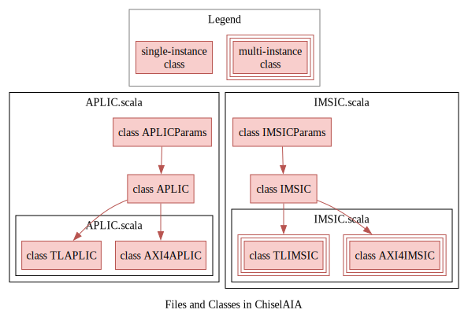
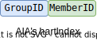
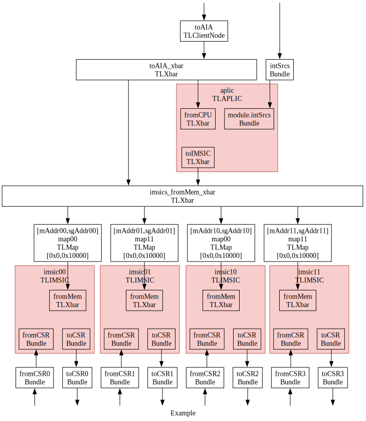

# 🧭集成指南（Integration Guide）

<!-- vim-markdown-toc GFM -->

* [概览（Overview）](#概览overview)
* [参数（Parameters）](#参数parameters)
  * [`IMSICParams`](#imsicparams)
  * [`APLICParams`](#aplicparams)
* [实例化（Instantiation）](#实例化instantiation)
  * [<span style="color:red;">关于hartIndex（About hartIndex）</span>](#span-stylecolorred关于hartindexabout-hartindexspan)
* [示例（Examples）](#示例examples)
  * [简单的4核系统（A Simple 4-Hart System）](#简单的4核系统a-simple-4-hart-system)
  * [分组的4核系统（A Grouped 4-Hart System）](#分组的4核系统a-grouped-4-hart-system)

<!-- vim-markdown-toc -->

本指南介绍如何将ChiselAIA集成到RISC-V系统中。

This guide introduces the integration process of ChiselAIA into a RISC-V system.


## 概览（Overview）

集成涉及2个Scala文件，共4个Scala类：

* `APLIC.scala`：
  * `APLICParams`：用于配置APLIC实例的参数类
  * `APLIC`：APLIC模块的核心逻辑
  * 每个系统需要一个实例：
    * `TLAPLIC`：对`APLIC`模块的Tilelink协议包装
    * `AXI4APLIC`：对`APLIC`模块的AXI4协议包装
* `IMSIC.scala`：
  * `IMSICParams`：用于配置IMSIC实例的参数类
  * `IMSIC`：IMSIC模块的核心逻辑
  * 每个处理器核心需要一个实例：
    * `TLIMSIC`：对`IMSIC`模块的Tilelink协议包装
    * `AXI4IMSIC`：对`IMSIC`模块的AXI4协议包装

Integration involves 2 scala files, including 4 scala classes:

* `APLIC.scala`:
  * `APLICParams`: Parameter classes for configuring APLIC instance.
  * `APLIC`: The main logic of APLIC module.
  * Requiring one instance per system:
    * `TLAPLIC`: The `APLIC` module wrapped by Tilelink protocol,
    * `AXI4APLIC`: The `APLIC` module wrapped by AXI4 protocol.
* `IMSIC.scala`:
  * `IMSICParams`: Parameter classes for configuring IMSIC instances.
  * `IMSIC`: The main logic of IMSIC module.
  * Requiring one instance per hart:
    * `TLIMSIC`: The `IMSIC` module wrapped by Tilelink protocol,
    * `AXI4IMSIC`: The `IMSIC` module wrapped by AXI4 protocol.



## 参数（Parameters）

本节概述了APLIC和IMSIC的可配置参数。
虽然提供了默认值，但我们强烈建议根据具体的集成需求，自定义带有👉标记的参数。
其他参数要么是派生的，要么是硬编码的（详情参见`Params.scala`）。

This section outlines the configurable parameters for APLIC and IMSIC.
While defaul values are provided,
we strongly recommend customizing parameters marked with 👉 to suit your specific integration needs.
Other parameters are either derived or hard-coded, (see `Params.scala` for details).

命名约定：
* `Num`后缀：某实体的数量，
* `Width`后缀：某实体的位宽（通常是`log2(实体数量)`），
* `Addr`后缀：某实体的地址。

Naming conventions:

* `Num` suffix: Number of the items.
* `Width` suffix: Bit width of an item (typically `log2(number of the item)`).
* `Addr` suffix: Address of an item.

### `IMSICParams`

{{#include ./IMSIC_scala.md}}

### `APLICParams`

{{#include ./APLIC_scala.md}}

## 实例化（Instantiation）

* `APLICParams`和`IMSICParams`：
  * 每个类一个实例，
  * 根据[参数](#参数parameters)部分的说明，实例化参数。
* `TLAPLIC`/`AXI4APLIC`：
  * 单个实例，
  * 参数`params`：接收`APLICParams`的实例，
* `TLIMSIC`/`AXI4IMSIC`：
  * 每个核心一个实例，
  * 参数`params`：接收`IMSICParams`的实例，

* `APLICParams` and `IMSICParams`:
  * Single instance each,
  * Instantiation parameters according to [Parameters](#参数parameters) section.
* `TLAPLIC`/`AXI4APLIC`:
  * Single instance,
  * Parameter `params`: receiving the `APLICParams`'s instance,
* `TLIMSIC`/`AXI4IMSIC`:
  * One instance per hart,
  * Parameter `params`: receiving the `IMSICParams`'s instance,

<!-- TODO: find a right place for hartIndex -->

### <span style="color:red;">关于hartIndex（About hartIndex）</span>

根据AIA规范：
<span style="color:red;">AIA的hart编号</span>
可能与RISC-V特权架构分配给hart的唯一
<span style="color:red;">hart标识符（“hart ID”）无关</span>。
在ChiselAIA中，hartIndex编码为groupID拼接上memberID。

According to the AIA specification:
The <span style="color:red;">AIA's hart index</span> may or
<span style="color:red;">may not have any relationship to</span> the unique
<span style="color:red;">hart identifier ("hart ID")</span>
that the RISC-V Privileged Architecture assigns to the hart.
In ChiselAIA, the hartIndex is encoded as a concatenation of `groupID` and `memberID`:



## 示例（Examples）

<!-- TODO: markcode A Grouped 4-Hart System -->

### 简单的4核系统（A Simple 4-Hart System）

对于一个简单的未分组系统，设置groupsNum=1，则可以将hart ID复用作为AIA的`hartIndex：

For a simple ungrouped system, set groupsNum=1 to allow reuse of hart ID as AIA's `hartIndex`:

```scala
val imsic_params = IMSICParams()
val aplic_params = APLICParams(groupsNum=1, membersNum=4)
val imsics = (0 until 4).map( i => {
  val imsic = LazyModule(new TLIMSIC(imsic_params)(Parameters.empty))
val aplic = LazyModule(new TLAPLIC(aplic_params)(Parameters.empty))
```

### 分组的4核系统（A Grouped 4-Hart System）

在`src/main/scala/Example.AIA`和`src/main/scala/Example-axi.scala`中，我们提供了一个如何实例化APLIC核IMSIC的示例
（我们的单元测试也是基于该示例）。
以Tilelink为例，我们接下来展示一些关键的代码：

We provide an example of instantiating the APLIC and IMSIC, in `src/main/scala/Example.AIA` and `src/main/scala/Example-axi.scala`
(Furthermore, we will use this example to conduct unit tests.).
Take Tilelink as an example, we provide key lines of code below:

```scala
val imsic_params = IMSICParams()
val aplic_params = APLICParams(groupsNum=2, membersNum=2)
val imsics = (0 until 4).map( i => {
  val imsic = LazyModule(new TLIMSIC(imsic_params)(Parameters.empty))
val aplic = LazyModule(new TLAPLIC(aplic_params)(Parameters.empty))
```

此配置创建了一个2位的`hartIndex`，高位表示 groupID，低位表示 memberID。
有关详细的IO连接，请参考下图和`src/main/scala/Example.AIA`。

This configuration creates a 2-bit `hartIndex` where the higher bit represents `groupID` and the lower bit represents `memberID`.
For detailed IO connections, refer to the following figure and `src/main/scala/Example.AIA`.


